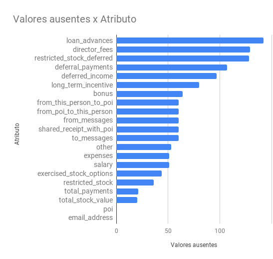
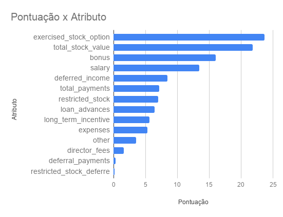
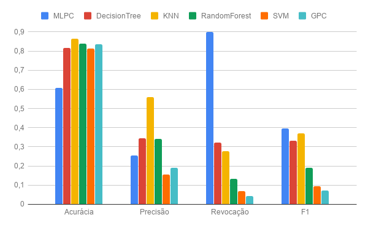

# Projeto de Machine Learning: Identificar fraudes nos e-mails da Enron - [Udacity](https://www.udacity.com/)

## Introdução
Em 2000, Enron era uma das maiores empresas dos EUA. Já em 2002, ela colapsou e quebrou devido a uma fraude que envolveu grande parte da corporação. Resultando em uma investigação federal, muitos dados que são normalmente confidenciais, se tornaram públicos, incluindo dezenas de milhares de e-mails e detalhes financeiros dos executivos nos mais altos níveis da empresa. Caso haja mais interesse por trás desse caso, existe um [documentário](https://en.wikipedia.org/wiki/Enron:_The_Smartest_Guys_in_the_Room) referente a essa grande ascensão e ruptura da empresa.

Esse projeto visou praticar as habilidades de machine learning durante a construção de um modelo preditivo para tentar determinar se um funcionário é ou não um funcionário de interesse (POI). Um funcionário de interesse é um funcionário que participou do escândalo da empresa.

Todo o projeto está contido na pasta `final_project`, com uso apenas do arquivo "externo" `tools/feature_format.py`. Demais pastas foram utilizadas ao longo do módulo de introdução a machine learning e estão disponibilizadas também nesse repositório apenas para consultas futuras.

### Objetivos
* Lidar com um conjunto de dados real e suas imperfeições;
* Validar resultados de aprendizagem de máquina usando dados de teste;
* Avaliar resultados de aprendizagem de máquina usando métricas quantitativas;
* Criar, selecionar e transformar atributos;
* Comparar a performance de algoritmos de aprendizagem de máquina;
* Otimizar algoritmos de aprendizagem de máquina para obter máxima performance;
* Comunicar resultados de aprendizagem de máquina de forma clara.

## Desenvolvimento do projeto

### Recursos necessários
Baixado o projeto incial do [repositório da Udacity](https://github.com/udacity/ud120-projects), cujo código pode ser encontrado no diretório `final_project`. Alguns arquivos relevantes são:

`poi_id.py`: Código inicial do identificar de pessoas de interesse (POI, do inglês Person of Interest). É neste arquivo que foi escrita a análise.

`final_project_dataset.pkl`: O conjunto de dados para o projeto. Veja mais detalhes abaixo. 

`tester.py`: Ao enviar o algoritmo, conjunto de dados, e a lista de atributos que foram utilizados (criados automaticamente pelo arquivo poi_id.py) para análise da Udacity. O avaliador usou este código para testar os resultados, para garantir que a performance é similar a obtida no relatório. Não precisa usar/modificar este código, mas é fornecido de forma transparente para os alunos testem seus algoritmos. 

`emails_by_address`: Este diretório contém diversos arquivos de texto, cada um contendo todas as mensagens de ou para um endereço de email específico. Estes dados estão aqui para referência, ou caso deseje criar atributos mais complexos baseando-se nos detalhes dos emails. A utilização desse arquivo é opcional no projeto.

### Etapas
Fornecido um código inicial pela Udacity que carrega os dados, seleciona os atributos e os colocam em um vetor `numpy`. O trabalho a partir disso foi utilizar engenharia sobre os atributos, escolher, otimizar algoritmos e testar suas respectivas capacidades preditivas. Depois será apresentado o desempenho dos algoritmos pós otimização.

Como etapa de pré-processamento deste projeto, foi combinado os dados da base "Enron email and financial" em um dicionário, onde cada par chave-valor corresponde a uma pessoa. A chave do dicionário é o nome da pessoa, e o valor é outro dicionário, que contém o nome de todos os atributos e seus valores para aquela pessoa. Os atributos nos dados possuem basicamente três tipos: atributos financeiros, de e-mail e rótulos POI (pessoa de interesse).

**atributos financeiros**: \['salary', 'deferral_payments', 'total_payments', 'loan_advances', 'bonus', 'restricted_stock_deferred', 'deferred_income', 'total_stock_value', 'expenses', 'exercised_stock_options', 'other', 'long_term_incentive', 'restricted_stock', 'director_fees'] (todos em dólares americanos (USD))

**atributos de email**: \['to_messages', 'email_address', 'from_poi_to_this_person', 'from_messages', 'from_this_person_to_poi', 'shared_receipt_with_poi'] (as unidades aqui são geralmente em número de emails; a exceção notável aqui é o atributo ‘email_address’, que é uma string)

**rótulo POI**: \[‘poi’] (atributo objetivo lógico (booleano), representado como um inteiro)

Encorajado a criar, transformar e re-escalar novos atributos a partir dos originais. Que deveriam ser armazenenadoos na estrutura `my_dataset`, e se utilizado estes atributos no modelo final, chama-los de `my_feature_list`, para que o avaliador fosse capaz de acessá-la durante os testes.

Como parte do projeto submetido, foi respondido uma série de perguntas demonstrando a linha de pensamento, que de certa forma é mais importante que o projeto final em si. Essa perguntas e respostas podem ser encontradas no arquivo `Udacity.pdf`.

### Questionário / Relatório
##### 1. Summarize for us the goal of this project and how machine learning is useful in trying to accomplish it. As part of your answer, give some background on the dataset and how it can be used to answer the project question. Were there any outliers in the data when you got it, and how did you handle those?

O objetivo do projeto, através de um olhar acadêmico, é aplicar todo o conhecimento
obtido no curso em uma base de dados mais "bruta" e desafiadora, uma vez que tem poucos
dados de treino. Já através da visão de "negócios", um algoritmo que consiga aprender a
identificar possíveis pessoas envolvidas na fraude, poderia auxiliar muito no processo
investigativo da polícia, economizando tempo e recursos.

Os dados disponibilizados nos dão uma ideia geral de quais características poderiam
influenciar diretamente nessa identificação. Contendo muitos dados faltantes e outliers, é
difícil de utilizar uma "solução de gaveta" para tentar prever esses indivíduos. Dizer se os
outliers são úteis ou problemáticos também faz parte desse processo.

No meu caso, considerei os outliers como informações úteis e essenciais, uma vez que
o algoritmo aprende com essas variáveis discrepantes, todavia, há duas chaves que tiveram
uma atenção especial, pois não se referiam a indivíduos de fato. Uma delas foi removida
manualmente e a outra foi removida junto as chaves com muitos valores faltantes.

O dataset fornecido contem 146 registros, sendo 12,3% (18 registros) de POIs e 87,7%
(128 registros) de n/POIs. Tendo 21 atributos, sendo um deles o atributo alvo. Há muitos
dados ausente em certos atributos. Abaixo é possível visualizar essa relação:  
  
12 registros foram removidos por serem inválidos, seja por ser outlier, bug ou conter
muitos atributos ausentes. A lista com todos os nomes está no final do arquivo.

##### 2. What features did you end up using in your POI identifier, and what selection process did you use to pick them? Did you have to do any scaling? Why or why not? As part of the assignment, you should attempt to engineer your own feature that does not come ready-made in the dataset -- explain what feature you tried to make, and the rationale behind it. (You do not necessarily have to use it in the final analysis, only engineer and test it.) In your feature selection step, if you used an algorithm like a decision tree, please also give the feature importance’s of the features that you use, and if you used an automated feature selection function like SelectKBest, please report the feature scores and reasons for your choice of parameter values.

Inicialmente comecei selecionando manualmente os atributos, verificando como os
classificadores lidavam com eles, mas após algumas tentativas, vi que a seleção manual não
estava sendo vantajosa. A única alteração manual que fiz foi condensar os atributos de trocas
de e-mails entre POIs e n/POIs, e os demais deixei que o SelectKBest selecionasse de seis a
todos os atributos, sendo que ele ficou melhor com seis atributos.

O escalonamento foi aplicável somente no SVM e KNN para tentar predizer os POIs, mas
usando árvore de decisão, não só seria desnecessário, como piorou um pouco o
desempenho.

Foram criados dois atributos, que se referem a percentagem de e-mails recebidos e
enviados para POIs, pois por mais que haja muitos e-mails trocados entre POIs e n/POIs, pode
ser que o percentual seja baixo. Apesar de criado esses dois atributos e eles fornecerem um
ganho de aproximadamente 4% na taxa de precisão e 2% de revocação no classificador final,
os mesmos não foram utilizados pois possuem a vantagem de saber quem são as pessoas de
interesse para qual o e-mail foi enviado ou recebido.

Após executar o SelectKBest nos dados de treino (por conta disso, pode haver certas
divergências, dependendo do tamanho dos dados de treino e da forma randômica que foram
selecionados), obtive as seguintes pontuações:  
  

#####  3. What algorithm did you end up using? What other one(s) did you try? How did model performance differ between algorithms? 

Foram realizados ajustes no SVM, MLPC, KNN, GPC, RandomForest e DecisionTree.

O único que ficou com a revocação altíssima, foi o MLPC, conseguindo encontrar
praticamente 90% das pessoas de interesse dentro do conjunto de dados., ao custo disso a
acurácia ficou próxima dos 60%, sendo o que mais apresentou falsos positivos (classificando
erroneamente como POI, alguém que não era) em sua predição. Já o KNN se destacou em
sua precisão, ficando próximo dos 55%, bem à frente dos demais, mas infelizmente não
conseguiu revocar nem 30% das pessoas de interesse. O SVM e o GPC tiveram um
desempenho muito ruim, tanto de revocação quanto de precisão, e a RandomForest por mais
que tenha atendido o requisito de 30% de precisão, ficou bem abaixo na revocação.

Através do parâmetro F1, é possível ver que o MLPC e o KNN ficaram levemente à frente
do DecisionTree, podendo ser uma boa escolha, se a revocação ou precisão não for tão
importante. A métrica F1 busca uma média harmônica entre a precisão e a revocação,
punindo valores extremos, como no caso do MLPC que obteve uma revocação muito acima,
mas o F1 não ficou muito à frente.

Nesse conjunto de dados desbalanceado, julgar o desempenho do classificador pela
acurácia, seria um grande erro, pois se hipoteticamente assumíssemos que todos os registros
não são pessoa de interesse, acertaríamos quase 90% das predições, enquanto que nosso
real objetivo é achar a menor parcela de pessoas de interesse.

Por fim o único classificador que ficou acima de 30% de precisão e revocação, foi o
DecisionTree, onde classificou um número pequeno de falsos positivos (se comparado ao
MLPC) e com revocação aceitável, sendo esse o motivo de ter sido escolhido no final,
atendendo assim a premissa inicial do projeto.  
  

#####  4. What does it mean to tune the parameters of an algorithm, and what can happen if you don’t do this well? How did you tune the parameters of your particular algorithm? What parameters did you tune? (Some algorithms do not have parameters that you need to tune -- if this is the case for the one you picked, identify and briefly explain how you would have done it for the model that was not your final choice or a different model that does utilize parameter tuning, e.g. a decision tree classifier). 

O ajuste nada mais é que o ato de adaptar o classificador ao conjunto de dados que você
tem, uma vez que os parâmetros padrões normalmente não se adaptam bem. Já o preço de
não adaptar é não ter um desempenho aceitável.

Decidi ajustar o número de amostras necessárias no nó para ser dividido, o critério para
a qualidade da divisão e o número mínimo de amostras que devem existir nas folhas, sendo
equivalentes aos parâmetros: min_samples_split, criterion e min_samples_leaf,
respectivamente, todos do classificador da árvore de decisão (DecisionTreeClassifier) da
biblioteca scikit-learn. Os demais parâmetros do classificador, eu optei por não alterar, uma
vez que a alteração piorava ou não influenciava no desempenho.

Os ajustes finais dos parâmetros de todos os classificadores podem ser visualizados no
final do arquivo.

##### 5. What is validation, and what’s a classic mistake you can make if you do it wrong? How did you validate your analysis?

A validação consiste em não se basear nos resultados de uma parte só dos dados, você
testa o algoritmo em outra parte(s) do conjunto de dados (separada previamente) para
avaliar o quão bem ele se sai em dados não vistos no treinamento, conseguindo gerar mais
confiança nos resultados e detectar se o algoritmo está sobreajustado nos dados de treino,
perdendo nesse caso a capacidade de generalização.

Na minha análise, comecei usando o KFold e depois optei pelo SSS por ser mais
adequado ao dataset fornecido, uma vez que a SSS tenta balancear o atributo alvo durante
os treinos e os testes, o que não acontece no KFold, que apenas divide aleatoriamente (ou
não) os dados em certa porcentagem, podendo acarretar em problemas, visto que o conjunto
de dados onde sendo usado possui poucos valores e é desbalanceado.

##### 6. Give at least 2 evaluation metrics and your average performance for each of them. Explain an interpretation of your metrics that says something human-understandable about your algorithm’s performance.

O limiar de desempenho escolhido foi o de 30% de precisão e revocação para acertar
possíveis pessoas de interesse dentro da fraude coorporativa da Enron, através do
classificador de rede neural e árvore de decisão, esses números foram alcançados, com leve
vantagem para a árvore de decisão, que alcançou aproximadamente 38% de precisão e 34%
de revocação. O desempenho foi relativamente baixo, por conta de haver poucos dados de
treino.

Outros classificadores e ajustes conseguiram alcançar revocação altíssima na medida
que a precisão ficou muito baixa, assim como em outros momentos a precisão era altíssima,
mas a revocação baixa.
Com a árvore de decisão devidamente treinada, há 32% de chance de predizer uma
pessoa de interesse e 34% dessa pessoa predita ser realmente de interesse.

Registros removidos durante limpeza da etapa 2 do código:
* TOTAL
* WODRASKA JOHN
* WHALEY DAVID A
* CLINE KENNETH W
* WAKEHAM JOHN
* WROBEL BRUCE
* SCRIMSHAW MATTHEW
* GILLIS JOHN
* LOCKHART EUGENE E
* THE TRAVEL AGENCY IN THE PARK
* SAVAGE FRANK
* GRAMM WENDY L

#### Parametrização final dos classificadores:
| **MLPC**                |         |   | **GPC**                   |               |   | **KNN**                |      |
|-------------------------|---------|---|---------------------------|---------------|---|------------------------|------|
| SelectKBest__K          | 12      |   | SelectKBest__K            | 14            |   | SelectKBest__K         | 14   |
| PCA__n_components       | 4       |   | PCA__n_components         | 5             |   | PCA__n_components      | 5    |
| CLF__learning_rate_init | 0.001   |   | Scaler                    | StandardScaler|   | Scaler                 | None |
| CLF__learning_rate      | constant|   | CLF__n_restarts_optimizer | 1             |   | CLF__n_components      | 3    |
| CLF__alpha              | 0.01    |   | CLF__max_iter_predict     | 2             |   | CLF__p                 | 3    |
| CLF__hidden_layer_sizes | 2       |   |                           |               |   |                        |      |
| CLF__activation         | logistic|   | **SVM**                   |               |   | **RandomForest**       |      |
| CLF__solver             | adam    |   | SelectKBest__K            | 6             |   | SelectKBest__K         | 10   |
| CLF__max_iter           | 10      |   | PCA__n_components         | 4             |   | PCA__n_components      | 4    |
|                         |         |   | Scaler                    | StandardScaler|   | CLF__n_estimators      | 5    |
| **DecisionTree**        |         |   | CLF__C                    | 1             |   | CLF__min_samples_split | 10   |
| SelectKBest__K          | 6       |   | CLF__gamma                | 100           |   | CLF__criterion         | gini |
| PCA__n_components       | 4       |   |                           |               |   | CLF__min_samples_leaf  | 2    |
| CLF__min_samples_split  | 5       |   |                           |               |   | CLF__max_features      | auto |
| CLF__criterion          | gini    |   |                           |               |   |                        |      |
| CLF__min_samples_leaf   | 3       |   |                           |               |   |                        |      |
